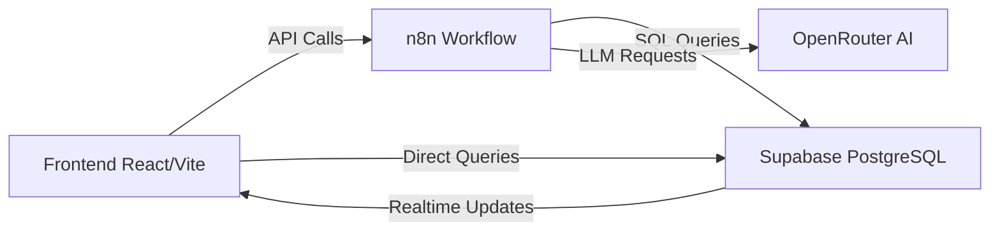

# 📋 Lista TODO Completa - W4U Writing Wizard

## 🎯 Contesto del Progetto

**W4U Writing Wizard** è un'applicazione SaaS per la scrittura assistita da AI che guida l'utente dalla concezione alla produzione di un libro completo.

### Architettura Attuale



### Stack Tecnologico
- **Frontend**: React 19, Vite, Framer Motion, React Router, Lucide Icons
- **Backend**: n8n (orchestrazione workflow AI)
- **Database**: Supabase (PostgreSQL + Realtime)
- **AI**: OpenRouter (modello: mistralai/devstral-2512:free)

### Schema Database (Dedotto dal Codice)

**Tabella `books`**
- `id` (UUID, PK)
- `title` (TEXT)
- `status` (TEXT) - Stati: INTERVIEW, CONCEPT, OUTLINE, PRODUCTION, COMPLETED
- `genre` (TEXT)
- `target_chapters` (INTEGER)
- `context_data` (JSONB) - Contiene: target_pages, initial_theme, selected_concept, chat_history, configuration

**Tabella `chapters`**
- `id` (UUID, PK)
- `book_id` (UUID, FK → books.id)
- `chapter_number` (INTEGER)
- `title` (TEXT)
- `summary` (TEXT)
- `content` (TEXT, nullable)
- `status` (TEXT) - Stati: PENDING, GENERATING, COMPLETED
- `subtitles` (JSONB, array)
- `key_points` (JSONB, array)
- `target_word_count` (INTEGER)

**Tabella `debug_logs`**
- `id` (UUID, PK)
- `source` (TEXT) - 'frontend' o 'n8n'
- `event_type` (TEXT)
- `payload` (JSONB)
- `book_id` (UUID, nullable)
- `created_at` (TIMESTAMP)

### Workflow Utente (Wizard Flow)

1. **Dashboard** → Creazione progetto (titolo, pagine, tema)
2. **ConceptPage** → Intervista AI + Generazione 4 concept cards
3. **ConfigurationPage** → Selezione target audience + Generazione outline
4. **BlueprintPage** → Revisione e conferma struttura capitoli (read-only)
5. **ProductionPage** → Generazione contenuti capitolo per capitolo
6. **EditorPage** → Editing con suggerimenti AI (MOCK - non implementato)
7. **ExportPage** → Download PDF/ePub/PNG (MOCK - non implementato)

---

## 🐛 BUG CRITICI (Priorità Alta)

### B1. ❌ Capitoli Generati Non Aggiornano Frontend Automaticamente
**File**: `ProductionPage.tsx`  
**Problema**: Dopo la generazione di un capitolo, serve F5 per vedere il contenuto aggiornato  
**Causa**: Il Realtime subscription funziona solo per UPDATE, ma il contenuto viene scritto la prima volta  
**Fix**:
```typescript
// In ProductionPage.tsx, linea 32-39
.on(
    'postgres_changes',
    { 
        event: '*',  // Cambia da 'UPDATE' a '*' per catturare INSERT e UPDATE
        schema: 'public', 
        table: 'chapters', 
        filter: `book_id=eq.${bookId}` 
    },
    (payload) => {
        const updated = payload.new as DBChapter;
        setChapters(prev => prev.map(c => c.id === updated.id ? { ...c, ...updated } : c));
    }
)
```

### B2. ❌ "Genera Tutto" Crasha l'Applicazione
**File**: `ProductionPage.tsx`, linea 78-87  
**Problema**: Il loop sequenziale blocca il thread e può causare timeout  
**Causa**: Chiamate sincrone senza gestione errori robusta  
**Fix**:
```typescript
const generateAll = async () => {
    setGlobalGenerating(true);
    const pendingChapters = chapters.filter(c => !c.content || c.status === 'PENDING');
    
    try {
        // Batch processing con Promise.allSettled per gestire errori individuali
        const results = await Promise.allSettled(
            pendingChapters.map(chap => generateChapter(chap.id))
        );
        
        const failed = results.filter(r => r.status === 'rejected').length;
        if (failed > 0) {
            alert(`${failed} capitoli non sono stati generati. Riprova.`);
        }
    } catch (err) {
        console.error("Errore generazione batch:", err);
        alert("Errore durante la generazione. Controlla la console.");
    } finally {
        setGlobalGenerating(false);
    }
};
```

### B3. ❌ EditorPage Usa Dati Mock Invece di Capitoli Reali
**File**: `EditorPage.tsx`, linea 11-15  
**Problema**: L'editor non è collegato ai capitoli reali dal database  
**Fix**: Implementare fetch da Supabase
```typescript
const [chapters, setChapters] = useState<DBChapter[]>([]);
const bookId = localStorage.getItem('active_book_id');

useEffect(() => {
    if (!bookId) return;
    const fetchChapters = async () => {
        const { data, error } = await supabase
            .from('chapters')
            .select('*')
            .eq('book_id', bookId)
            .order('chapter_number', { ascending: true });
        
        if (error) console.error(error);
        if (data) setChapters(data);
    };
    fetchChapters();
}, [bookId]);
```

---

## ⚠️ PROBLEMI FUNZIONALI (Priorità Media)

### F1. 🔧 Domande Intervista Casuali e Mal Strutturate
**File**: Workflow n8n, nodo "Agent: Interviewer" (linea 260)  
**Problema**: L'AI fa domande generiche senza seguire un percorso strutturato  
**Note**: Sticky note nel workflow conferma "le domande dell'intervista sono totalmente casuali e fatte male"  
**Fix**: Implementare sistema di domande progressive
```javascript
// Nel prompt dell'Agent: Interviewer
const interviewStages = {
  1: "Qual è il tema centrale o il messaggio che vuoi trasmettere?",
  2: "Chi è il protagonista e qual è il suo obiettivo principale?",
  3: "Qual è il conflitto principale che deve affrontare?",
  4: "Come si conclude la storia? Quale trasformazione avviene?",
  5: "Qual è il tono emotivo prevalente? (es: drammatico, ironico, nostalgico)"
};

// Tracciare lo stage nell'context_data.interview_stage
```

### F2. 🔧 Limite Domande Intervista Non Implementato
**File**: Workflow n8n + `ConceptPage.tsx`  
**Problema**: Nessun limite al numero di domande, può diventare infinito  
**Note**: Sticky note conferma "dobbiamo decidere quante e quali domande fare"  
**Fix**:
1. Aggiungere `interview_stage` e `max_interview_questions: 5` in `context_data`
2. In `ConceptPage.tsx`, disabilitare input dopo 5 domande
3. Mostrare progress bar (es: "Domanda 3/5")

### F3. 🔧 Editor Capitoli Modifica Struttura Globale
**File**: `EditorPage.tsx` (attualmente mock)  
**Problema**: L'editor potrebbe permettere modifiche che rompono la coerenza  
**Note**: Sticky note conferma "l'editor dei capitoli modifica un po' tutta la struttura di tutti i capitoli, evitabile"  
**Fix**: Quando implementato, limitare editing solo al `content` del capitolo selezionato, non a `title` o `summary`

### F4. 🔧 Manca Reminder Pagine Scelte
**File**: Tutti i componenti wizard  
**Problema**: L'utente non vede più quante pagine ha scelto durante il percorso  
**Riferimento**: `todo.txt` linea 13  
**Fix**: Aggiungere componente header persistente
```tsx
// In MainLayout.tsx
const [bookInfo, setBookInfo] = useState<{pages?: number, title?: string}>(null);

useEffect(() => {
    const bookId = localStorage.getItem('active_book_id');
    if (bookId) {
        supabase.from('books').select('title, context_data').eq('id', bookId).single()
            .then(({data}) => {
                if (data) setBookInfo({
                    title: data.title,
                    pages: data.context_data?.target_pages
                });
            });
    }
}, []);

// Mostrare in alto a destra: "📖 {title} - {pages} pagine"
```

---

## 🚀 FEATURE MANCANTI (Priorità Media-Alta)

### M1. 🆕 Autenticazione Utente (Supabase Auth)
**File**: Nuovo - `AuthContext.tsx`, `LoginPage.tsx`, `SignupPage.tsx`  
**Riferimento**: `todo.txt` Fase A, linea 2  
**Implementazione**:
1. Configurare Supabase Auth (email + password)
2. Aggiungere RLS policies alle tabelle `books` e `chapters`
3. Creare context per gestire sessione utente
4. Proteggere routes con `PrivateRoute` component

### M2. 🆕 Tutorial/Onboarding Primo Accesso
**File**: Nuovo - `OnboardingPage.tsx`  
**Riferimento**: `todo.txt` linea 4  
**Implementazione**: Carousel con 3-4 slide che spiegano il workflow

### M3. 🆕 Dashboard Adattiva Basata su Stato Progetto
**File**: `Dashboard.tsx`  
**Riferimento**: `todo.txt` linea 6 (IN PROGRESS)  
**Problema**: Attualmente mostra solo "Crea Nuovo" o "Inserisci UUID"  
**Fix**: Aggiungere sezione "I Tuoi Progetti" con card per ogni libro
```tsx
const [projects, setProjects] = useState([]);

useEffect(() => {
    supabase.from('books').select('*').order('created_at', {ascending: false})
        .then(({data}) => setProjects(data || []));
}, []);

// Mostrare card con: titolo, status, progress bar, bottone "Continua"
```

### M4. 🆕 Pricing e Checkout Pre-Generazione
**File**: Nuovo - `PricingPage.tsx`  
**Riferimento**: `todo.txt` Fase B, linee 9-11  
**Implementazione**:
1. Slider per selezione pagine (min 50, max 500)
2. Calcolo prezzo dinamico (es: €0.10/pagina)
3. Integrazione Stripe Checkout
4. Bloccare generazione se non pagato

### M5. 🆕 Controllo Qualità Risposte AI
**File**: `ConceptPage.tsx`, workflow n8n  
**Riferimento**: `todo.txt` linea 21  
**Implementazione**: Validare lunghezza risposte utente
```tsx
const validateResponse = (text: string) => {
    if (text.length < 20) {
        return "La risposta è troppo breve. Fornisci più dettagli (almeno 20 caratteri).";
    }
    if (text.split(' ').length < 5) {
        return "Prova a espandere la tua risposta con più parole.";
    }
    return null;
};
```

### M6. 🆕 Pagina Riepilogo Pre-Generazione Indice
**File**: Nuovo - `SummaryPage.tsx` (tra Configuration e Blueprint)  
**Riferimento**: `todo.txt` linea 23  
**Scopo**: Mostrare tutte le scelte fatte prima di generare l'outline

### M7. 🆕 Editor Capitoli con Autosalvataggio
**File**: `EditorPage.tsx` (da implementare completamente)  
**Riferimento**: `todo.txt` linea 28  
**Implementazione**:
```tsx
const [content, setContent] = useState('');
const [lastSaved, setLastSaved] = useState<Date | null>(null);

useEffect(() => {
    const timer = setTimeout(() => {
        supabase.from('chapters')
            .update({ content })
            .eq('id', selectedChapterId)
            .then(() => setLastSaved(new Date()));
    }, 2000); // Autosave dopo 2 secondi di inattività
    
    return () => clearTimeout(timer);
}, [content]);
```

### M8. 🆕 Revisione AI per Modifiche Testo
**File**: `EditorPage.tsx`, nuovo nodo n8n "Agent: Editor"  
**Riferimento**: `todo.txt` linea 30  
**Implementazione**: Aggiungere action "EDIT" al workflow n8n
```typescript
// Frontend
const requestEdit = async (chapterId: string, instruction: string) => {
    const result = await callBookAgent('EDIT', {
        chapterId,
        instruction // es: "Rendi questo paragrafo più descrittivo"
    }, bookId);
    // Applicare suggerimento
};
```

### M9. 🆕 Generazione PDF/ePub con Standard Amazon
**File**: Nuovo - `ExportService.ts`, backend export endpoint  
**Riferimento**: `todo.txt` linea 33  
**Implementazione**:
1. Usare libreria `pdfkit` o `jsPDF` per PDF
2. Usare `epub-gen` per ePub
3. Configurare margini, font (es: Garamond 12pt), interlinea 1.5

### M10. 🆕 Generatore Copertina AI
**File**: Nuovo - `CoverGeneratorPage.tsx`  
**Riferimento**: `todo.txt` linea 35  
**Implementazione**: Integrare DALL-E o Stable Diffusion via API

### M11. 🆕 Libreria Progetti Storici
**File**: `Dashboard.tsx` + nuovo `LibraryPage.tsx`  
**Riferimento**: `todo.txt` linea 37  
**Implementazione**: Griglia con tutti i progetti completati, con preview copertina e download

---

## 🎨 MIGLIORAMENTI UX/UI (Priorità Bassa)

### U1. 💅 Formattazione Testo dall'AI (Grassetto, Corsivo)
**File**: Workflow n8n, `ProductionPage.tsx`, `EditorPage.tsx`  
**Riferimento**: `todo.txt` linea 44  
**Problema**: L'AI genera testo plain, senza markdown  
**Fix**: Modificare prompt Agent: Writer per usare markdown
```javascript
// Nel prompt
"Scrivi il contenuto usando Markdown per la formattazione:
- **grassetto** per enfasi
- *corsivo* per pensieri o dialoghi interni
- # per titoli di sezione"
```

### U2. 💅 Editor ad Albero (Capitoli → Paragrafi)
**File**: `EditorPage.tsx`  
**Riferimento**: `todo.txt` linea 42  
**Implementazione**: Struttura gerarchica
```tsx
<div className="tree-editor">
    {chapters.map(chapter => (
        <div key={chapter.id}>
            <h3>{chapter.title}</h3> {/* Non editabile */}
            {chapter.paragraphs.map(para => (
                <div>
                    <h4>{para.subtitle}</h4> {/* Non editabile */}
                    <textarea value={para.content} onChange={...} /> {/* Editabile */}
                </div>
            ))}
        </div>
    ))}
</div>
```

### U3. 💅 Script Conversione PNG per Impaginazione
**File**: Nuovo - `ExportService.ts`  
**Riferimento**: `todo.txt` linea 46  
**Implementazione**: Usare `html2canvas` per convertire pagine HTML in PNG

---

## 🔧 REFACTORING E BEST PRACTICES (Priorità Bassa)

### R1. 🛠️ Centralizzare Creazione Client Supabase
**File**: Multipli (`Dashboard.tsx`, `BlueprintPage.tsx`, `ProductionPage.tsx`, etc.)  
**Problema**: `createClient` duplicato in ogni file  
**Fix**: Usare solo `import { supabase } from '../../lib/api'`

### R2. 🛠️ Gestione Errori Consistente
**File**: Tutti i componenti  
**Problema**: Alcuni usano `alert()`, altri `console.error`, nessun toast/notification system  
**Fix**: Implementare context per notifiche globali
```tsx
// NotificationContext.tsx
export const useNotification = () => {
    const showError = (msg: string) => { /* toast rosso */ };
    const showSuccess = (msg: string) => { /* toast verde */ };
    return { showError, showSuccess };
};
```

### R3. 🛠️ Validazione Schema Database con TypeScript
**File**: Nuovo - `types/database.ts`  
**Implementazione**: Generare types da Supabase CLI
```bash
npx supabase gen types typescript --project-id YOUR_PROJECT_ID > src/types/database.ts
```

### R4. 🛠️ Separare Logica Business da UI
**File**: Tutti i componenti wizard  
**Problema**: Logica API mixing con rendering  
**Fix**: Creare custom hooks
```tsx
// hooks/useBookWorkflow.ts
export const useBookWorkflow = (bookId: string) => {
    const [book, setBook] = useState(null);
    const [loading, setLoading] = useState(false);
    
    const updateBook = async (updates) => { /* ... */ };
    const generateOutline = async () => { /* ... */ };
    
    return { book, loading, updateBook, generateOutline };
};
```

### R5. 🛠️ Ottimizzare Workflow n8n
**File**: `AI Book Generator - Wizard Flow V2.json`  
**Problemi**:
1. Nodi duplicati (`Get Book Context1`, `Get Book Context Concept1`, etc.)
2. Manca gestione errori nei nodi HTTP Request
3. Prompt hardcoded invece di template riutilizzabili

**Fix**:
1. Consolidare nodi di fetch in un unico "Get Book Context"
2. Aggiungere nodi "Error Handler" dopo ogni HTTP Request
3. Usare variabili d'ambiente per prompt templates

---

## 📊 SCHEMA PRIORITÀ IMPLEMENTAZIONE

### Sprint 1 - Stabilità (2-3 settimane)
1. ✅ **B1**: Fix Realtime update capitoli
2. ✅ **B2**: Fix "Genera Tutto" crash
3. ✅ **B3**: Collegare EditorPage a dati reali
4. ✅ **R1**: Centralizzare Supabase client
5. ✅ **R2**: Sistema notifiche globale

### Sprint 2 - Funzionalità Core (3-4 settimane)
1. ✅ **M1**: Autenticazione Supabase
2. ✅ **M3**: Dashboard adattiva con progetti
3. ✅ **F4**: Reminder pagine scelte
4. ✅ **M7**: Editor con autosalvataggio
5. ✅ **F1**: Migliorare intervista AI

### Sprint 3 - Monetizzazione (2-3 settimane)
1. ✅ **M4**: Pricing e checkout
2. ✅ **M2**: Onboarding tutorial
3. ✅ **M5**: Controllo qualità risposte

### Sprint 4 - Export e Finalizzazione (3-4 settimane)
1. ✅ **M9**: Generazione PDF/ePub
2. ✅ **M10**: Generatore copertina AI
3. ✅ **M11**: Libreria progetti storici
4. ✅ **U3**: Export PNG

### Sprint 5 - Polish (1-2 settimane)
1. ✅ **U1**: Formattazione testo AI
2. ✅ **U2**: Editor ad albero
3. ✅ **M8**: Revisione AI testo
4. ✅ **R3-R5**: Refactoring e ottimizzazioni

---

## 🗂️ MODIFICHE DATABASE NECESSARIE

### Nuove Colonne
```sql
-- Tabella books
ALTER TABLE books ADD COLUMN user_id UUID REFERENCES auth.users(id);
ALTER TABLE books ADD COLUMN created_at TIMESTAMP DEFAULT NOW();
ALTER TABLE books ADD COLUMN updated_at TIMESTAMP DEFAULT NOW();
ALTER TABLE books ADD COLUMN is_paid BOOLEAN DEFAULT FALSE;
ALTER TABLE books ADD COLUMN cover_url TEXT;

-- Tabella chapters
ALTER TABLE chapters ADD COLUMN paragraphs JSONB DEFAULT '[]';
ALTER TABLE chapters ADD COLUMN created_at TIMESTAMP DEFAULT NOW();
ALTER TABLE chapters ADD COLUMN updated_at TIMESTAMP DEFAULT NOW();
```

### Nuove Tabelle
```sql
-- Tabella per tracking pagamenti
CREATE TABLE payments (
    id UUID PRIMARY KEY DEFAULT gen_random_uuid(),
    book_id UUID REFERENCES books(id) ON DELETE CASCADE,
    user_id UUID REFERENCES auth.users(id),
    amount DECIMAL(10,2),
    currency VARCHAR(3) DEFAULT 'EUR',
    stripe_payment_id TEXT,
    status TEXT, -- 'pending', 'completed', 'failed'
    created_at TIMESTAMP DEFAULT NOW()
);

-- Tabella per export history
CREATE TABLE exports (
    id UUID PRIMARY KEY DEFAULT gen_random_uuid(),
    book_id UUID REFERENCES books(id) ON DELETE CASCADE,
    format TEXT, -- 'pdf', 'epub', 'png'
    file_url TEXT,
    created_at TIMESTAMP DEFAULT NOW()
);
```

### Row Level Security (RLS)
```sql
-- Abilitare RLS
ALTER TABLE books ENABLE ROW LEVEL SECURITY;
ALTER TABLE chapters ENABLE ROW LEVEL SECURITY;

-- Policy: utenti vedono solo i propri libri
CREATE POLICY "Users can view own books" ON books
    FOR SELECT USING (auth.uid() = user_id);

CREATE POLICY "Users can insert own books" ON books
    FOR INSERT WITH CHECK (auth.uid() = user_id);

CREATE POLICY "Users can update own books" ON books
    FOR UPDATE USING (auth.uid() = user_id);

-- Policy: capitoli accessibili solo se il libro appartiene all'utente
CREATE POLICY "Users can view own chapters" ON chapters
    FOR SELECT USING (
        book_id IN (SELECT id FROM books WHERE user_id = auth.uid())
    );
```

---

## 📝 NOTE FINALI

### Debito Tecnico Identificato
1. **Mancanza di testing**: Nessun test unitario o E2E
2. **Hardcoded values**: URL webhook, modelli AI, prezzi
3. **Gestione stato**: Uso eccessivo di `localStorage` invece di context/state management
4. **Accessibilità**: Nessun attributo ARIA, navigazione keyboard limitata
5. **Performance**: Nessun lazy loading, code splitting, o memoization

### Rischi Architetturali
1. **Dipendenza da n8n**: Se n8n va down, l'intera app è inutilizzabile
2. **Costi AI**: Modello free ha rate limits, può bloccare utenti
3. **Scalabilità**: Realtime subscriptions possono diventare costose con molti utenti
4. **Sicurezza**: Anon key Supabase esposta nel frontend (normale, ma serve RLS)

### Raccomandazioni Strategiche
1. **Implementare queue system**: Per generazione capitoli (es: BullMQ + Redis)
2. **Caching**: Salvare risposte AI per evitare rigenerazioni costose
3. **Monitoring**: Aggiungere Sentry per error tracking
4. **Analytics**: Integrare Posthog o Mixpanel per capire comportamento utenti
5. **Backup**: Configurare backup automatici Supabase
6. **CI/CD**: Setup GitHub Actions per deploy automatico

---

## 📞 Prossimi Passi Consigliati

1. **Prioritizzare Sprint 1** per stabilizzare l'app esistente
2. **Decidere modello di pricing** prima di implementare checkout
3. **Definire limiti free tier** (es: 1 libro gratis, poi pagamento)
4. **Creare roadmap pubblica** per comunicare feature in arrivo
5. **Setup ambiente staging** separato da produzione

---

**Documento creato**: 2026-01-22  
**Versione progetto analizzata**: v0.0.0  
**Totale items identificati**: 35 (11 bug/problemi + 24 feature/miglioramenti)
