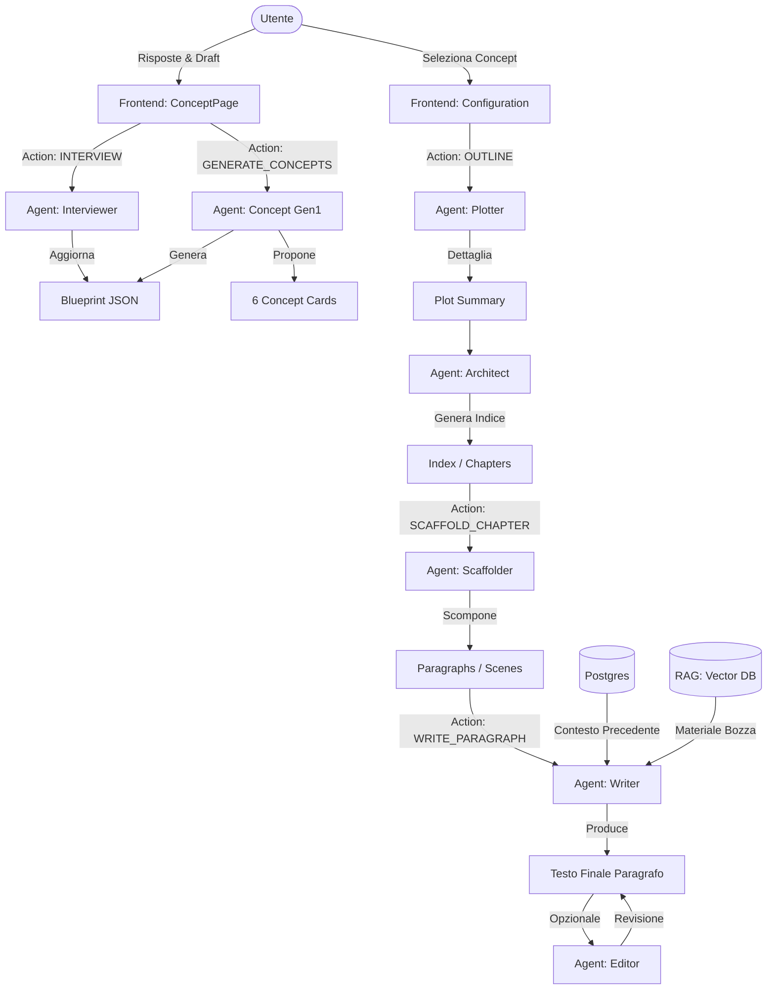

# Architettura di Generazione del Testo - W4U Writing Wizard

Questo documento descrive il flusso end-to-end che porta dalla prima idea dell'utente al testo finale del libro, mappando ogni agente e il relativo passaggio logico.

## 🗺️ Mappa dell'Architettura

## 🔄 Descrizione dei Passaggi

### 1. Fase Esplorativa (Intervista & Concept)
L'obiettivo è trasformare l'idea vaga dell'utente in un **Blueprint** tecnico.
- **Interviewer**: Conduce una chat interattiva per riempire i vuoti di trama o struttura.
- **Concept Gen1**: Analizza gli input e propone 6 direzioni diverse (concept). Qui viene definito se il libro è Fiction o Non-Fiction, influenzando tutti i passaggi successivi.

### 2. Fase Strutturale (Plot & Index)
Una volta scelto il concept, l'IA costruisce le fondamenta.
- **Plotter**: Crea una trama estesa e coerente.
- **Architect**: Progetta l'indice (capitoli), assicurandosi che il numero di capitoli rispetti il target di pagine impostato.

### 3. Fase di Produzione (Scaffold & Write)
Il lavoro viene atomizzato per massimizzare la qualità e gestire i limiti di contesto dei modelli.
- **Scaffolder**: Prende un capitolo e lo divide in scene (fiction) o sezioni logiche (non-fiction). Questo assicura che lo scrittore abbia compiti precisi di circa 250 parole.
- **Writer**: L'agente finale. Scrive il testo usando:
    - **Blueprint**: Per mantenere lo stile e i temi.
    - **Contesto Locale**: I paragrafi immediatamente precedenti per la fluidità.
    - **RAG**: Frammenti della bozza originale caricata dall'utente (se presente).

### 4. Fase di Revisione
- **Editor**: Analizza il testo generato alla ricerca di incongruenze o errori, fornendo suggerimenti all'utente.
